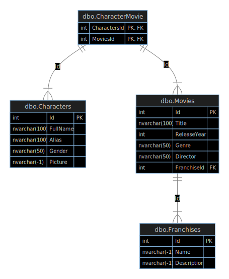

# Movie Characters API

A Web API for managing movies, characters, and franchises. This API allows you to track which characters appear in which movies, and which movies belong to which franchises.

## Table of Contents
- [Technologies Used](#technologies-used)
- [Database Structure](#database-structure)
- [Getting Started](#getting-started)
- [API Endpoints](#api-endpoints)
- [Contributing](#contributing)
- [License](#license)
- [Author](#author)

## Technologies Used
- .NET 6
- Entity Framework Core
- SQL Server
- Swagger/OpenAPI

## Database Structure


## Getting Started

### Prerequisites
- .NET 6 SDK
- SQL Server
- Visual Studio 2022 (recommended) or VS Code

### Installation
1. Clone the repository
```bash
git clone https://github.com/mlvrkhn/movie-characters-api.git
```

2. Update the connection string in `appsettings.json`
```json
{
  "ConnectionStrings": {
    "DefaultConnection": "Your-Connection-String"
  }
}
```

3. Run the application
```bash
dotnet run
```

The API will be available at `https://localhost:7xxx` and the Swagger documentation at `https://localhost:7xxx/swagger`

## API Endpoints

### Movies
- `GET /api/movies` - Get all movies
- `GET /api/movies/{id}` - Get movie by ID
- `POST /api/movies` - Create new movie
- `PUT /api/movies/{id}` - Update movie
- `DELETE /api/movies/{id}` - Delete movie

### Characters
- `GET /api/characters` - Get all characters
- `GET /api/characters/{id}` - Get character by ID
- `POST /api/characters` - Create new character
- `PUT /api/characters/{id}` - Update character
- `DELETE /api/characters/{id}` - Delete character

### Franchises
- `GET /api/franchises` - Get all franchises
- `GET /api/franchises/{id}` - Get franchise by ID
- `POST /api/franchises` - Create new franchise
- `PUT /api/franchises/{id}` - Update franchise
- `DELETE /api/franchises/{id}` - Delete franchise

## Contributing
1. Fork the repository
2. Create your feature branch (`git checkout -b feature/AmazingFeature`)
3. Commit your changes (`git commit -m 'Add some AmazingFeature'`)
4. Push to the branch (`git push origin feature/AmazingFeature`)
5. Open a Pull Request

## License
This project is licensed under the MIT License - see the [LICENSE](LICENSE) file for details.

## Author [@mlvrkhn](https://github.com/mlvrkhn)